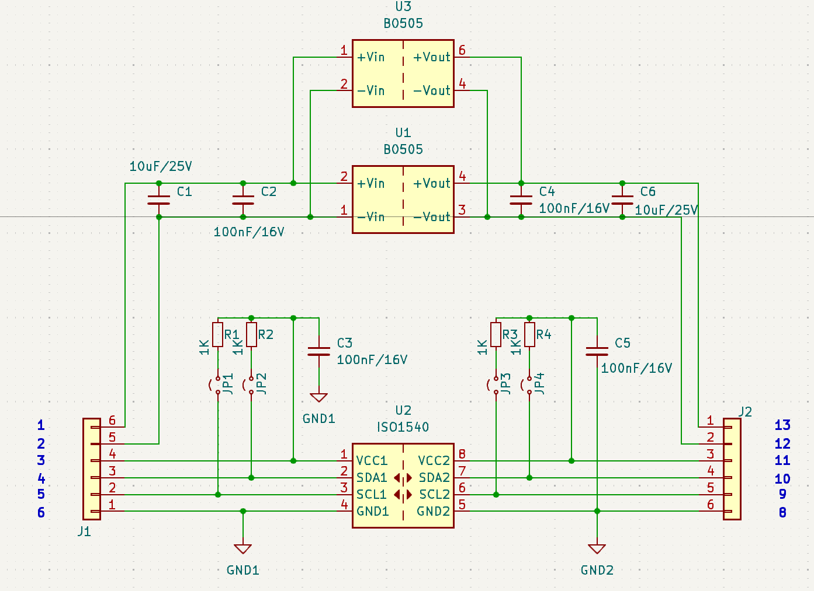
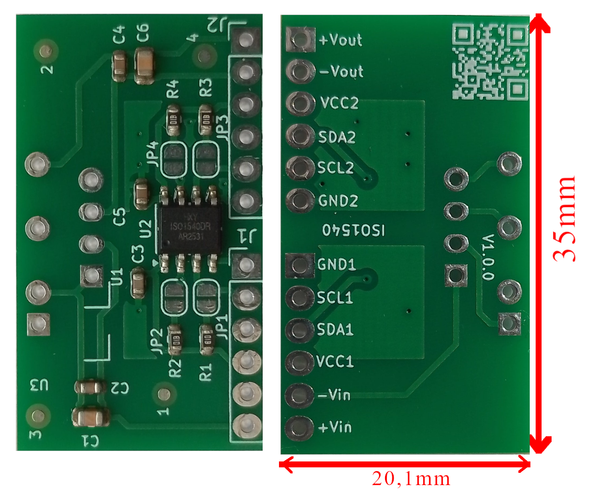

# ISOI2C
I2C bus isolation module

## General information about the module.

This module is based on ISO1540 chips.  
* Supply voltage: 3V - 5.5V.
* The isolator is bidirectional.
* Maximum frequency: 1 MHz
* Side 1 open-collector: 3.5 mA
* Side 2 open-collector: 35 mA
* Module dimensions: 20.1 mm x 35 mm
* The module is designed to accommodate an isolating converter, such as the B0505.
* All signals are located on one edge of the module, minimizing the footprint on the target PCB.

<picture></picture>
<picture></picture>
